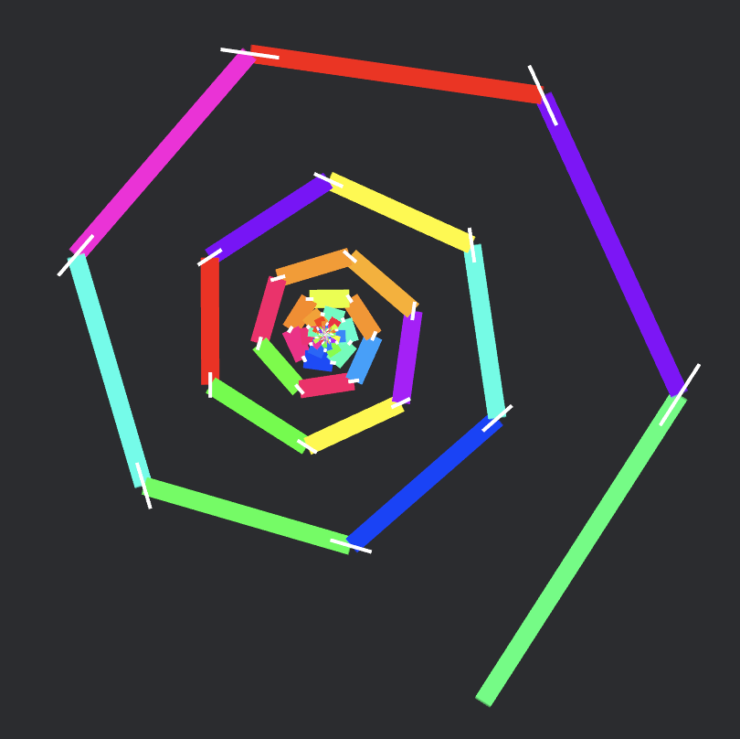
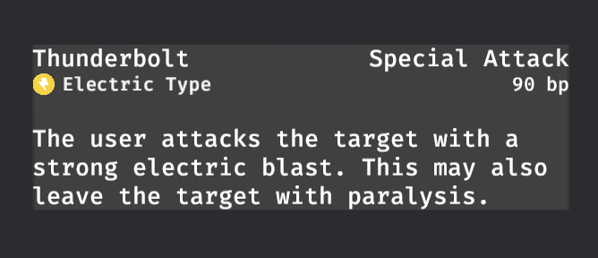
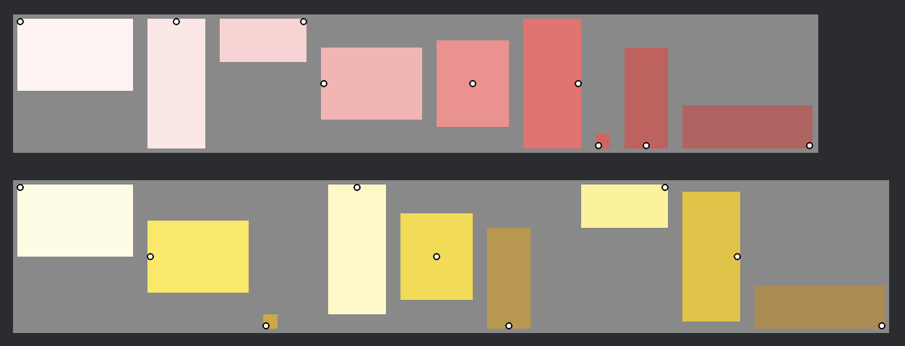
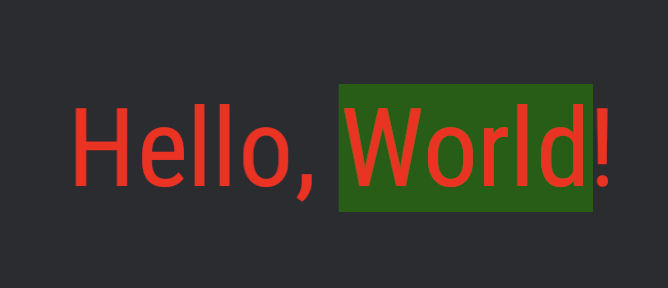
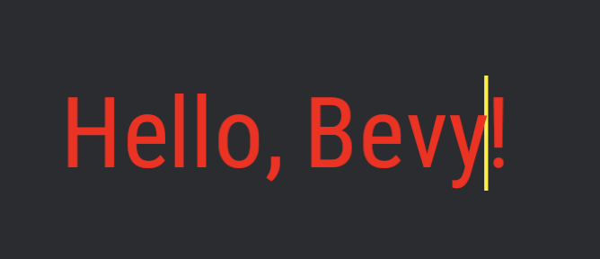

# Bevy AoUI

[](https://crates.io/crates/bevy_aoui)
[](https://docs.rs/bevy_aoui/latest/bevy_aoui/)

A light-weight anchor-offset based 2D sprite layout system for the bevy engine.

Bevy AoUI provides a light-weight rectangular anchor-offset based 2D sprite layout,
UI layout and skeletal animation system.

Similar to the philosophy of Rust, AoUI provides low level control through the
anchor-offset system and high level ergonomics through its layout system.

## Getting Started

Before you start you should check out `bevy_aoui_widgets`'s examples if you like shapes or DSL.

[](https://crates.io/crates/bevy_aoui_widgets)
[](https://docs.rs/bevy_aoui_widgets/latest/bevy_aoui_widgets/)

First add the AoUI Plugin:

```rust
app.add_plugins(AoUIPlugin)
```

Create a sprite:

```rust
commands.spawn(AoUISpriteBundle {
    sprite: Sprite { 
        color: Color::RED,
        ..Default::default()
    },
    transform: Transform2D { 
        center: Some(Anchor::Center),
        anchor: Anchor::TopCenter,
        offset: Vec2::new(20.0, 0.0),
        rotation: 1.21,
        scale: Vec2::new(4.0, 1.0),
        ..Default::default()
    },
    dimension: Dimension::pixels(Vec2::new(50.0, 50.0)),
    texture: assets.load("sprite.png"),
    ..Default::default()
});
```

Create some text:

```rust
commands.spawn(AoUITextBundle {
    text: Text::from_section(
        "Hello, World!!", 
        style(Color::WHITE)
    ),
    font: assets.load::<Font>("OpenSans.ttf"),
    transform: Transform2D { 
        center: Some(Anchor::Center),
        anchor: Anchor::TopCenter,
        offset: Vec2::new(20.0, 0.0),
        rotation: 1.21,
        scale: Vec2::new(4.0, 1.0),
        ..Default::default()
    },
    dimension: Dimension::COPIED.with_em(SetEM::Pixels(24.0)),
    ..Default::default()
});
```

If you don't like the verbosity, check out the DSL in `bevy_aoui_widgets`:

```rust
button! ((commands, assets) {
    dimension: size2!([12 em, 2 em]),
    font_size: em(2),
    hitbox: Rect(1),
    cursor: CursorIcon::Hand,
    child: rectangle!{
        dimension: size2!([100%, 100%]),
        fill: color!(blue500),
    },
    child: textbox!{
        text: "Click Me!",
        color: color!(gold),
        z: 0.1
    },
    extra: handler!{LeftClick => fn click_handler() {
        println!("Hello!")
    }},
});
```

## Core Concepts

AoUI offers a refreshingly different paradigm from traditional CSS based UI layout.

AoUI Sprites contains these core components:

* [anchor](Transform2D::anchor)
* [center](Transform2D::center)
* [offset](Transform2D::offset)
* [rotation](Transform2D::rotation)
* [scale](Transform2D::scale)
* [dimension](Dimension::dim)

Each sprite is conceptualized as a rectangle with a dimension and
9 [anchors](bevy::sprite::Anchor): `BottomLeft`, `CenterRight`, `Center`, etc.

[Custom anchors](bevy::sprite::Anchor::Custom) can be used but not in some layouts.

Sprites are connected to parent sprites via one of the parent's anchors
and can be offset by a `Vec2`. When the offset is set to `(0, 0)`,
the anchors of the parent and child sprites overlap.

In the case of parentless sprites, they are anchored to the window's rectangle.

When applying `rotation` and `scale`, sprites can use a
`center` that operates independently from the anchor.

## Container

Anchor-Offset is well-suited for isolated UI components, but when it comes to arranging
multiple UI elements in a specific order, you'll find the `Container` useful.

The `Container` is a layout system that only depands on insertion order and works
with Bevy's [`Children`](bevy::prelude::Children) component.

Check out the book for more information.

## Advantages of AoUI

There are many awesome UI libraries in the bevy ecosystem
that you should definitely use over AoUI in
many use cases. However, AoUI offers some unique advantages:

* Full ECS support with easy feature composition.

AoUI is built fully embracing bevy's ecosystem.
You can mix and match our modularized components
and add, remove or edit any system you want to change.

* Relative size system.

Full support for web like size units: `em`, `rem`, `%`, etc.

* First class rotation and scaling support.

You are can rotate and scale any sprite from any position on it with ease.

* Simple but versatile layout system.

Simple layouts that work out of the box with minimal configuration.

* High level abstractions with low level control.

You can mix and match anchoring and layouts to best suit your needs.

## FAQ

### What about the widgets?

`bevy_aoui` is a layout system, not a widget library.
Implementations of most AoUI widgets
will live outside of the main crate, like in `bevy_aoui_widgets`.

`bevy_aoui_widgets` is a lot more experimental and subject to more
changes than `bevy_aoui`. Checkout our examples for simple widget implementations.

`AoUI` is commited to not have a standard look and not interacting with the
render pipeline as much as possible, therefore the standard widgets
might not be an out-of-the-box solution for you.

### Where about the performance?

`bevy_aoui` is an ergonomic focused crate with some performance tradeoffs,
each sprite has to go through multiple steps of rotation and scaling compared
to traditional rendering. Currently performance optimization features like
`no_rotation` are removed for API consistancy, this might change in the future
if the api become more stablized.

Performance related pull requests and suggestions are welcome.

### Showcase

* Skeletal Animation



* Rich Text with the `paragraph` layout.



* The `compact` and `span` layout.



* Single line text input.




### Bevy Versions

| bevy | bevy_aoui | bevy_aoui_widgets |
| -- | -- | -- |
| 0.12 | 0.1-latest | 0.1-latest |

## TODOs

* [ ] Scissor rect, very important for scrolling support.
* [ ] Official TextureAtlasSprite widget.
* [x] Rich text implementation.
* [ ] Atlas/skeletal animation asset importer.
